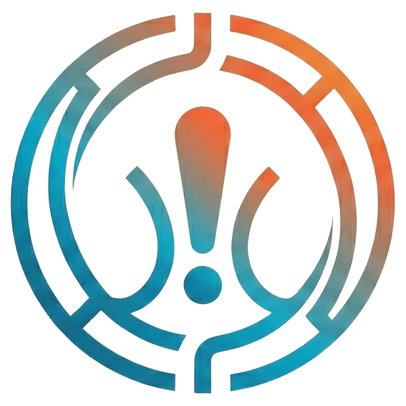

<div align="center">



# AlertLens

**A modern UI for Prometheus Alertmanager — visualize, silence, and manage configurations with ease.**

[](https://github.com/AlertLens/AlertLens/actions/workflows/ci.yml)
[](https://github.com/AlertLens/AlertLens/pkgs/container/alertlens)
[](https://golang.org)
[](LICENSE)
[](https://alertlens.github.io/AlertLens/)

</div>

---

AlertLens bridges the gap between Alertmanager's minimal built-in UI and the complexity of managing alert configurations at scale. Unlike read-only dashboards, it lets you **understand, visualize, and act** on the full alert lifecycle — from a single, stateless binary with zero runtime dependencies.

## Features

| | |
|---|---|
| **Alert Visualization** | Kanban or dense list view. Filter with Alertmanager's native matcher syntax. Group by any label. |
| **Multi-instance aggregation** | Connect multiple Alertmanager or Grafana Mimir instances into a single unified view. |
| **Routing Tree Visualizer** | Interactive D3 graph of your route hierarchy. Click a node to see which active alerts match. |
| **1-click Silences** | Create silences directly from any active alert, with pre-filled matchers and a duration picker. |
| **Bulk Actions** | Select multiple alerts and silence or ack them in one operation. |
| **Visual Ack** | Stateless acknowledgement built on Alertmanager silences — no database required. |
| **Configuration Builder** | Edit routing tree, receivers, and time intervals through guided forms with live YAML preview. |
| **GitOps Integration** | Push `alertmanager.yml` changes directly to GitHub or GitLab with configurable commit messages. |
| **Admin mode** | JWT-based admin session for write operations. Read-only access is always public. |

## Quick Start

### Docker

```bash
docker run -d \
  --name alertlens \
  -p 9000:9000 \
  -e ALERTLENS_ALERTMANAGERS_0_URL=http://alertmanager:9093 \
  ghcr.io/alertlens/alertlens:latest
```

Open [http://localhost:9000](http://localhost:9000).

### Binary

Download the latest binary from the [Releases](https://github.com/AlertLens/AlertLens/releases) page, then:

```bash
./alertlens -config alertlens.yaml
```

### Minimal configuration

```yaml
alertmanagers:
  - name: production
    url: http://alertmanager.example.com:9093

auth:
  admin_password: "your-strong-password"   # omit for read-only mode
```

See [config.example.yaml](config.example.yaml) for all available options.

## Multi-instance

```yaml
alertmanagers:
  - name: prod-eu
    url: http://alertmanager-eu:9093

  - name: prod-us
    url: http://alertmanager-us:9093

  - name: staging
    url: http://alertmanager-staging:9093
    tls_skip_verify: true
```

Alerts from all instances are aggregated into a single view. Each alert displays a source badge, and an instance filter lets you narrow the view.

## GitOps

Push configuration changes directly to your git repository:

```yaml
gitops:
  github:
    token: ""   # or ALERTLENS_GITOPS_GITHUB_TOKEN
  gitlab:
    token: ""   # or ALERTLENS_GITOPS_GITLAB_TOKEN
```

Before any write, AlertLens shows a unified diff. You confirm — then the change is committed and pushed. An optional webhook can trigger Argo CD or any CI pipeline.

## Compatibility

| Product | Support |
|---|---|
| Prometheus Alertmanager | Full (API v2) |
| Grafana Mimir | Full (`X-Scope-OrgID` per instance) |

## Build from source

Requires Go 1.25+ and Node.js 20+.

```bash
git clone https://github.com/AlertLens/AlertLens.git
cd AlertLens
make build
./alertlens -config alertlens.yaml
```

## Documentation

Full documentation at **[alertlens.github.io/AlertLens](https://alertlens.github.io/AlertLens/)**.

- [Getting Started](https://alertlens.github.io/AlertLens/getting-started/)
- [Configuration Reference](https://alertlens.github.io/AlertLens/configuration/)
- [Docker Deployment](https://alertlens.github.io/AlertLens/deployment/docker/)
- [Configuration Builder](https://alertlens.github.io/AlertLens/features/config-builder/)

## Architecture

AlertLens is fully **stateless**. All state lives in Alertmanager — AlertLens only reads and writes through the API.

```
Browser ──► AlertLens (Go binary + embedded SvelteKit frontend)
                │
                ├──► Alertmanager / Mimir (API v2)
                └──► GitHub / GitLab API  (GitOps)
```

- Backend: Go 1.25, chi router, zap logger
- Frontend: SvelteKit + Tailwind CSS + shadcn/svelte
- Single binary via `go:embed` — no Node.js at runtime
