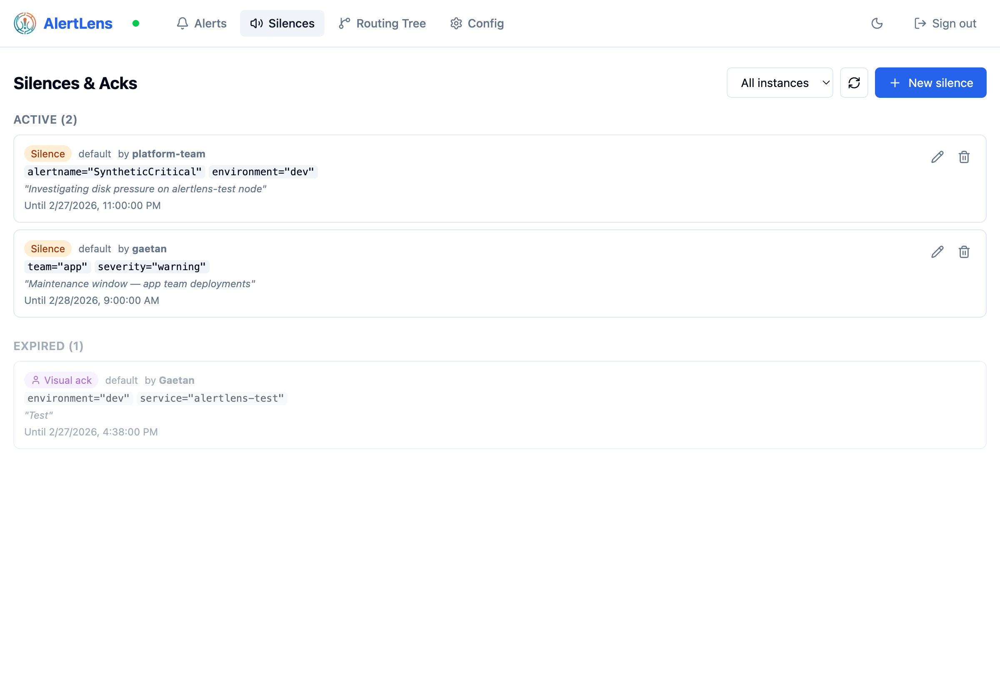
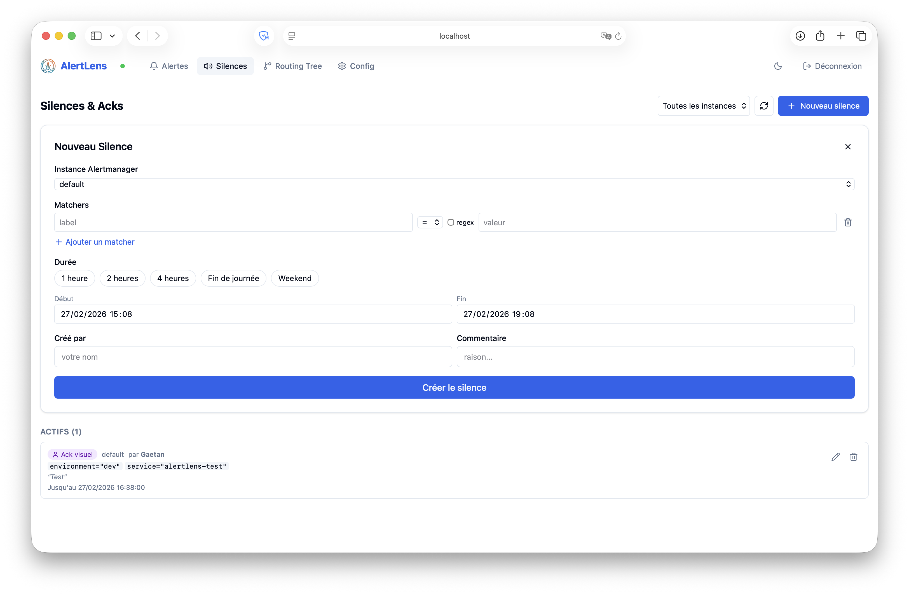

# Silence Management

AlertLens makes creating and managing Alertmanager silences fast and friction-free.

!!! note "Admin mode required"
    Creating, editing, and expiring silences requires admin mode. See [Authentication](../getting-started.md#enable-admin-mode).

---

## Creating a Silence from an Alert

1. Click on any active alert to open its detail panel.
2. Click **Silence** — matchers are pre-filled from the alert's labels.
3. Adjust matchers if needed (e.g., silence a whole team instead of a single alert).
4. Pick a duration using the human-friendly picker.
5. Add a comment (encouraged — it shows in Alertmanager's silence list).
6. Confirm.

The silence is created via the Alertmanager API and takes effect immediately.

---

## Duration Picker

The duration picker offers common options and a custom input:

| Option | Duration |
|---|---|
| 1 hour | 1h |
| 4 hours | 4h |
| Until end of day | Dynamic |
| Weekend | Until Monday 08:00 |
| Custom | Free input (e.g., `2h30m`) |

---

## Bulk Silence

Select multiple alerts using the checkboxes, then choose **Silence selected** from the bulk action toolbar.

AlertLens computes the **common matchers** across all selected alerts and pre-fills the silence form with them. You can review and adjust before confirming.

This is useful for silencing a wave of alerts from a failing component while a fix is deployed.

---

## Managing Existing Silences

The **Silences** page lists all active and pending silences from all configured instances.

From this page you can:

- **Expire a silence early** — removes it immediately from Alertmanager.
- **Edit a silence** — adjust matchers, duration, or comment (creates a new silence in Alertmanager).
- **Filter silences** — by creator, comment, or matcher.

---

## Relationship with Visual Ack

[Visual Ack](visual-ack.md) is implemented on top of Alertmanager silences, using reserved labels. These silences appear in the silence list but are visually distinguished from regular silences.

Do not manually edit Visual Ack silences — use the ack interface instead.
