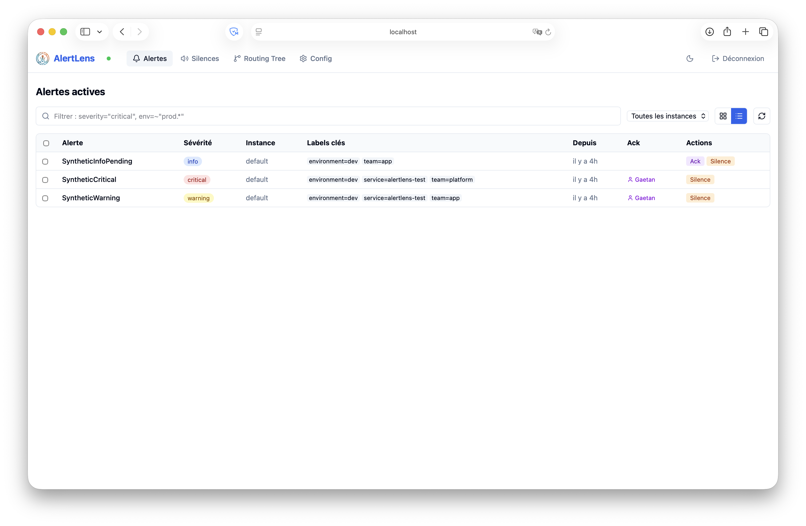

# AlertLens

{ width=140 }

**AlertLens** is a lightweight, modern UI for Prometheus Alertmanager and Grafana Mimir that bridges the gap between alert visualization and configuration management.

Unlike read-only dashboards, AlertLens lets you **understand, visualize, and act** on the full alert lifecycle — all from a single, stateless binary.

---

## Why AlertLens?

| Pain | AlertLens solution |
|---|---|
| Alertmanager's built-in UI is minimal | Rich Kanban/list view with filters and grouping |
| Silences require manual YAML knowledge | 1-click silence from any active alert |
| "Who is working on this?" is unclear | Visual Ack mechanism built on top of Alertmanager silences |
| Editing `alertmanager.yml` is risky | Validated diffs + GitOps push (GitHub / GitLab) |
| Managing multiple clusters is painful | Native multi-instance aggregation |

---

## Key Features

<div class="grid cards" markdown>

- :material-bell-alert: **Alert Visualization**

    Kanban or dense list view. Filter with Alertmanager's native matcher syntax. Group by any label. Aggregate across multiple instances.

- :material-volume-off: **1-Click Silences**

    Create silences directly from active alerts. Pre-filled matchers, human-friendly duration picker. Bulk silence for multi-alert selection.

- :material-hand-okay: **Visual Ack**

    Acknowledge who is handling an alert. Stateless: powered by Alertmanager silences with reserved labels. No database required.

- :material-file-edit: **Configuration Builder**

    Edit the routing tree, receivers, and mute times with a guided UI. Live YAML preview and diff before save. Validate with the official Prometheus library.

- :material-git: **GitOps Integration**

    Push `alertmanager.yml` changes directly to GitHub or GitLab. Atomic writes with configurable commit messages and webhook triggers.

- :material-server: **Zero Dependencies**

    Single binary. Frontend embedded via `go:embed`. No database, no state, no sidecar. Deploy with Docker or drop the binary.

</div>



---

## Quick Start

=== "Docker"

    ```bash
    docker run -p 9000:9000 \
      -e ALERTLENS_ALERTMANAGERS_0_URL=http://alertmanager:9093 \
      ghcr.io/gaetanars/alertlens:latest
    ```

=== "Binary"

    ```bash
    # Download the latest release from GitHub Releases, then:
    ./alertlens -config alertlens.yaml
    ```

Then open [http://localhost:9000](http://localhost:9000).

---

## Compatibility

| Product | Support |
|---|---|
| Prometheus Alertmanager | Full (API v2) |
| Grafana Mimir (multi-tenant) | Full (`X-Scope-OrgID` per instance) |
| Alertmanager API v1 | Out of scope |

---

## Architecture at a Glance

AlertLens is fully **stateless**. All state (silences, routes, alerts) lives in Alertmanager. AlertLens only reads and writes through the Alertmanager API v2.

```
Browser ──► AlertLens (Go binary + embedded SvelteKit)
                │
                ├──► Alertmanager #1 (API v2)
                ├──► Alertmanager #2 (API v2)
                └──► GitHub / GitLab API (GitOps)
```

[Get started →](getting-started.md){ .md-button .md-button--primary }
[Configuration reference →](configuration.md){ .md-button }
